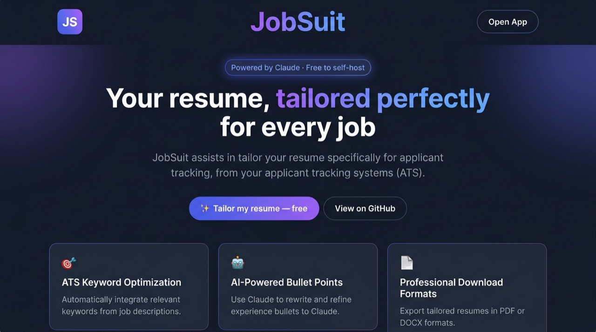
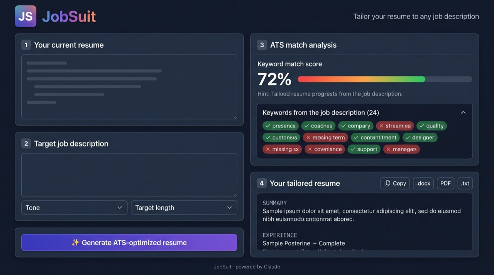

# JobSuit

**JobSuit** tailors your resume to any job description using **Claude** (Anthropic). It rewrites for clarity and ATS alignment, surfaces **live keyword match scoring**, and exports **`.docx`**, **`.pdf`**, or **`.txt`**.

Your **Anthropic API key stays on the server** — visitors never see it.

Stack: **Next.js 14** (App Router), **TypeScript**, **Tailwind CSS**, **Anthropic SDK**.

---
## Deployed Preview
https://job-suit-nextgen.vercel.app/

## Screenshots

Representative views of the app (marketing landing and tailor workspace).

| Landing | Tailor workspace |
| :-----: | :--------------: |
|  |  |

---

## Features

- **Landing page** (`/`) — product overview and entry to the app.
- **Tailor** (`/tailor`) — paste resume + job description, pick tone and target length, generate.
- **ATS-style analysis** — extracts keywords from the JD and shows match % plus matched / missing terms (updates as you edit or after generation).
- **Exports** — copy to clipboard; download Word, PDF, or plain text with sensible section and bullet formatting.
- **Local persistence** — resume, JD, tone, and length are saved in `localStorage` so a refresh does not wipe your work.

---

## Requirements

- **Node.js ≥ 18.17** (Node 20 LTS recommended). If `node -v` shows 16.x, use Homebrew’s Node 20, e.g. `export PATH="/usr/local/opt/node@20/bin:$PATH"` (Apple Silicon: `/opt/homebrew/opt/node@20/bin`).
- An [Anthropic API key](https://console.anthropic.com/)

---

## Quick start

```bash
npm install
cp .env.example .env.local
# Edit .env.local — set ANTHROPIC_API_KEY
npm run dev
```

Open [http://localhost:3000](http://localhost:3000). Use **Open App** or go to `/tailor`.

### Environment variables

| Variable | Required | Description |
| -------- | -------- | ----------- |
| `ANTHROPIC_API_KEY` | Yes | Server-side key for Claude. Never commit real keys. |
| `ANTHROPIC_MODEL` | No | Model id (default in code: `claude-sonnet-4-5`). |

Use `.env.local` locally; on **Vercel** (or similar), set the same variables in the project dashboard.

### What belongs in Git

**Commit:** application source, `package.json` / lockfile, `README.md`, `.env.example`, `docs/`, and `next-env.d.ts` (TypeScript refs for Next — regenerate with `next dev` or `next build` if missing).

**Do not commit:** anything ignored by `.gitignore`, including:

- **Secrets:** any `.env*` file except `.env.example` (see `.gitignore`)
- **Dependencies:** `node_modules/`
- **Build output:** `.next/`, `out/`, `dist/`
- **Deploy metadata:** `.vercel/`
- **OS / editor noise:** `.DS_Store`, `Thumbs.db`, `.vscode/`, `.idea/`
- **Local AI tooling:** `.claude/` (Claude Code machine-specific settings)
- **Caches:** `*.tsbuildinfo`, `.eslintcache`, `.turbo`

If you are unsure, run `git status` before committing and never `git add .env*`.

### Scripts

| Command | Purpose |
| ------- | ------- |
| `npm run dev` | Development server |
| `npm run build` | Production build |
| `npm run start` | Run production server (after `build`) |
| `npm run lint` | ESLint |

---

## Deploy

The app is a standard **Next.js 14** project. The easiest path is **[Vercel](https://vercel.com)** (same team as Next.js).

### Vercel (recommended)

1. Push this repo to **GitHub** (or GitLab / Bitbucket).
2. In [vercel.com/new](https://vercel.com/new), **Import** the repository. Vercel detects Next.js automatically.
3. Under **Environment Variables**, add (at least for **Production**; add Preview if you want previews to call Claude too):
   - `ANTHROPIC_API_KEY` — your server key from [Anthropic Console](https://console.anthropic.com/).
   - `ANTHROPIC_MODEL` — optional; defaults to `claude-sonnet-4-5` in code if unset.
4. **Deploy**. Your site will get a `*.vercel.app` URL; attach a custom domain in Project → **Domains** if you like. With the default Git integration, each push to your production branch triggers a new deploy.

**CLI (optional):** install the [Vercel CLI](https://vercel.com/docs/cli), run `vercel login`, then from the repo root run `vercel` (preview) or `vercel --prod`. Add secrets with `vercel env add ANTHROPIC_API_KEY` or in the dashboard under **Settings → Environment Variables**.

`vercel.json` requests up to **60s** for `app/api/tailor/route.ts`. On **Hobby**, serverless timeouts are shorter than on **Pro**, so very slow Claude calls may time out until you upgrade or the model responds faster. Redeploy after changing env vars.

### Smoke test before / after deploy

```bash
PATH="/usr/local/opt/node@20/bin:$PATH" npm run build && npm run start
```

Then open `/` and `/tailor`, run one generation, and confirm downloads work.

### Other hosts

Any platform that can run **Node 18+** and a **Next.js** production build (`npm run build` → `npm run start`) works (Docker, Railway, Fly.io, AWS, etc.). Set the same environment variables as on Vercel. For serverless platforms, mirror the **function timeout** and **Node** version settings so `/api/tailor` can finish.

---

## Project layout

```
├── app/
│   ├── api/tailor/route.ts   # POST → Anthropic, returns tailored text + score
│   ├── tailor/page.tsx       # Tailor page metadata + app shell
│   ├── layout.tsx
│   ├── page.tsx              # Re-exports landing page
│   └── globals.css
├── components/
│   ├── landing/              # Marketing page sections
│   ├── tailor/               # Resume tailor UI, hooks, export helpers
│   └── ResumeTailorApp.tsx   # Re-export of tailor/ResumeTailorApp
├── lib/
│   ├── keywords.ts           # JD keyword extraction + match scoring
│   ├── parseResumeOutput.ts  # Shared line parsing for .docx / PDF
│   └── prompt.ts             # System prompt builder
├── docs/screenshots/         # README imagery
├── .env.example
├── vercel.json               # Serverless maxDuration for /api/tailor (Vercel)
└── package.json
```

---

## License

MIT — use and modify freely.
